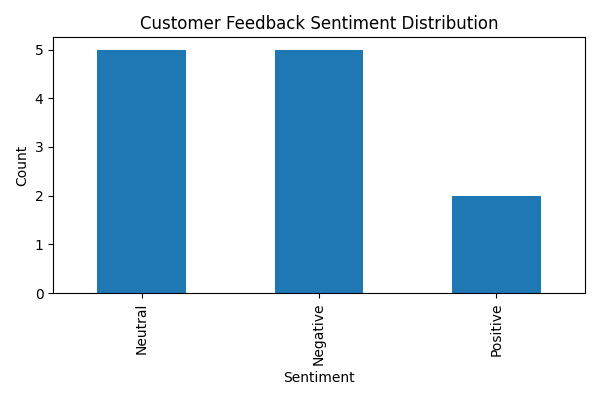

# AI Customer Feedback Analytics Automation

## Overview

This project demonstrates an **AI-powered automation pipeline** that analyzes customer feedback and generates actionable business insights automatically.

The system reads customer feedback from a CSV file, performs **AI-based sentiment and insight analysis**, generates an **overall business report**, and visualizes sentiment distribution using a chart.

This type of workflow is commonly used in:

* Customer experience analysis
* Product feedback monitoring
* Support ticket analysis
* Business intelligence pipelines

---

## Workflow

Customer Feedback CSV
↓
Python Processing Script
↓
AI Sentiment & Insight Analysis (OpenAI API)
↓
Individual Feedback Analysis Report
↓
AI Generated Overall Business Report
↓
Sentiment Visualization (Chart)

---

## Features

* Analyze multiple customer feedback entries automatically
* AI-based **sentiment detection**
* AI-generated **feedback summaries**
* **Suggested improvements** for each feedback
* Automated **overall business report generation**
* **Sentiment distribution visualization**
* Structured output for further analytics pipelines

---

## Example Use Cases

* E-commerce product feedback analysis
* SaaS platform customer feedback monitoring
* Customer support insight extraction
* Market research automation

---

## Project Structure

```
ai-feedback-analyzer/
│
├── automation.py               # Main automation script
├── feedback.csv                # Input dataset containing customer feedback
├── analysis_results.csv        # AI-generated analysis for each feedback
├── overall_report.txt          # AI-generated business insights report
├── sentiment_distribution.png  # Sentiment visualization chart
├── app.py                      # Streamlit dashboard UI
├── .env                        # OpenAI API key
└── README.md
```

---

## Technologies Used

* Python
* OpenAI API
* Pandas
* Matplotlib
* Streamlit
* Pillow
* python-dotenv

---

## Installation

Install required packages:

```
pip install openai pandas python-dotenv matplotlib streamlit pillow
```

---

## Configuration

Create a `.env` file and add your OpenAI API key:

```
OPENAI_API_KEY=your_api_key_here
```

---

## Running the Project

Run these commands in order:

1. Generate analysis outputs (CSV, report, and chart):

```
python automation.py
```

2. Launch the Streamlit dashboard:

```
python -m streamlit run app.py
```

3. Open in browser:

```
http://localhost:8501
```

The dashboard shows all outputs on a single page with collapsible sections:

* Executive summary and key metrics
* Detailed business report
* Sentiment distribution analysis
* Raw analysis data with filtering and CSV export

---

## Output Files

### Individual Feedback Analysis

`analysis_results.csv`

Contains AI-generated analysis for each feedback entry including:

* Sentiment classification
* Summary of the feedback
* Suggested improvement

### Overall Business Report

`overall_report.txt`

AI-generated report including:

* Overall customer sentiment
* Most common complaints
* Positive aspects mentioned by customers
* Business improvement recommendations

### Sentiment Visualization

`sentiment_distribution.png`

A bar chart showing the distribution of sentiment across all feedback entries.

---

## Sentiment Distribution Chart



---

## Example AI Output

**Overall Sentiment**

Customers are generally satisfied with product quality and usability, though delivery speed and mobile stability issues were mentioned.

**Top Complaints**

1. Slow delivery
2. Mobile app crashes
3. Delayed support responses

**Positive Aspects**

1. Product quality
2. Helpful support team
3. Good platform usability

**Recommendations**

* Improve logistics and delivery operations
* Fix mobile application stability
* Reduce customer support response time

---

## Future Improvements

Potential upgrades for this project:

* Real-time feedback processing
* Integration with CRM systems
* Automated email reporting
* Authentication and role-based dashboard access
* Advanced analytics dashboards

---

## Author

AI Automation & API Integration Demo Project
Built to demonstrate practical **AI workflow automation** using Python and OpenAI APIs.
